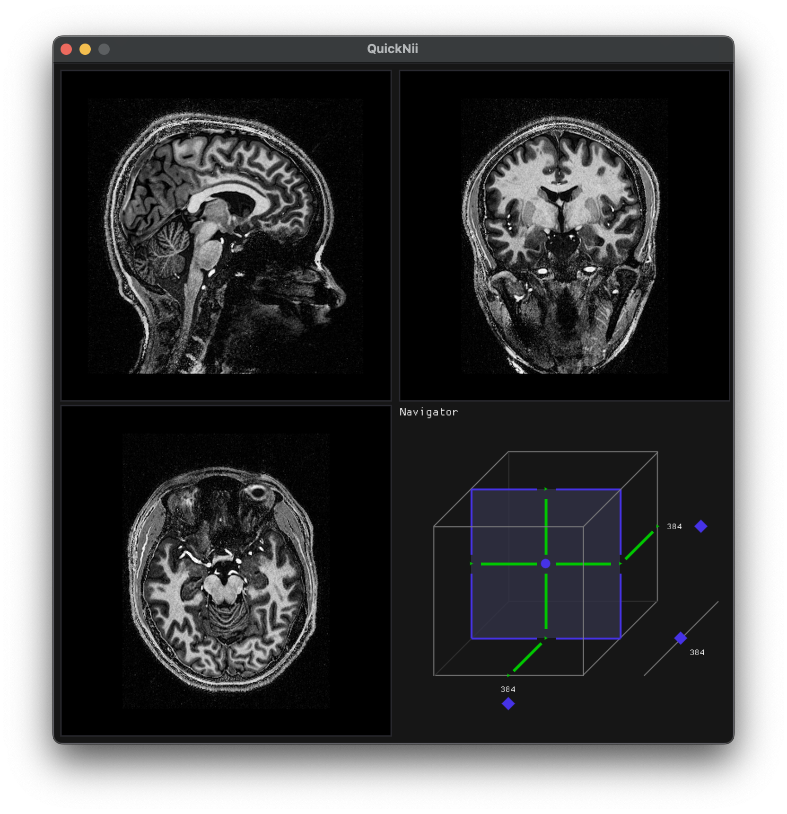

# QuickNii - Quick and easy NIfTI file viewer

QuickNii is a simple NIfTI file viewer that allows you to quickly view NIfTI files in a simple and easy to use interface. It is designed to be a lightweight and fast viewer that can be used to quickly view NIfTI files without the need for a full-featured medical imaging viewer.




## Features

- Simple and easy to use interface
- Fast and lightweight
- Supports viewing NIfTI files in both 3D and 4D (Work in progress)
- Static Linked (No need to install any dependencies)

## Roadmap
- Fix memory issue
- Avoid stretching the image
- Support for 4D NIfTI files
- Support for BrainVoyager format (VMR/V16, FMR/STC)
- Metadata display
- Efficient orientation transformation to RAS

## Usage
```
QuickNii <NIfTI file> // that's it
```

## Development
Clone the repository and run the following commands:
```
chmod +x init.sh && ./init.sh
make
```
The init.sh script will download the necessary dependencies and build the project. The make command will build the project and create the QuickNii executable in the build directory.

To install the executable, run the following command:
```
make install
```
It require sudo user privileges to install the executable.

## License
MIT License
